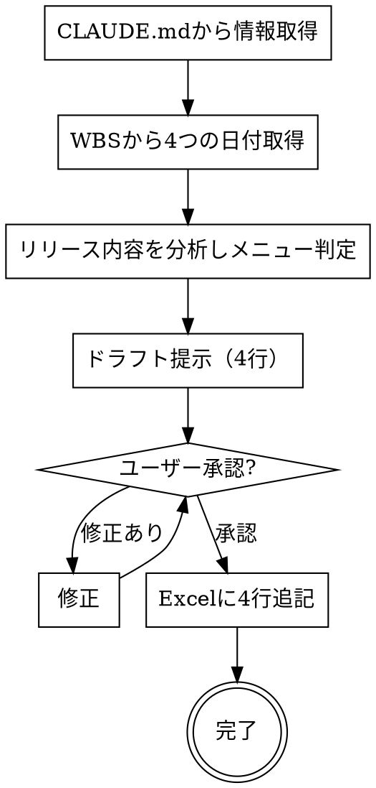

## Overview

リリース調整票は複数チームが当日一斉に動くリリース作業の司令書で、記載漏れがあると作業開始や承認が止まる。
プロジェクトの `CLAUDE.md` に案件情報・担当者・WBSパスを書いておき、リリース内容はコード・仕様書から Claude が読み取ることで、ヒアリングなしに自動組み立てできる設計にしている。
WBS のリリース日（UAT/UAT予備/PRD/PRD予備）に対応する **4行を1セット** で作成し、テンプレートに直接追記する。

## When to Use

- リリース作業が確定し、リリース調整表への記入依頼が来たとき
- 対象外: メール送付（別途手動）、リリースチケット起票（`/release-ticket` を使う）

## The Process



### Step 1: CLAUDE.mdから情報取得

プロジェクトの `CLAUDE.md` の `## リリース調整票` セクションから以下を読む。

| 項目 | CLAUDE.mdキー | 固定値 |
|------|--------------|--------|
| 個保/団保 | — | `個保` |
| リリース種別 | — | `開発` |
| PJ名 | `PJ名` | — |
| 案件名 | `案件名` | — |
| システム | `システム` | — |
| 担当社員 | `担当社員` | — |
| 開発チーム | — | `PMC` |
| テンプレートパス | `テンプレートパス` | — |
| 作業チーム | — | `SD` |
| 作業時間 | — | `1h` |
| 開始時刻 | — | `13:00` |

### Step 2: WBSから4つの日付取得

`CLAUDE.md` に記載の WBS パスを `~/claude/scripts/read_wbs.py` で読み込み、
以下の4行分の `planned_to` 日付を取得する。

| 行ラベル | WBS の lv1 | lv2 | 環境 | J列（予備） |
|---------|-----------|-----|------|------------|
| UAT本番 | UAT | リリース | UAT | （空欄） |
| UAT及び本番 | UAT | リリース予備 | UAT | `予備` |
| 本番 | PRD | リリース | PRD | （空欄） |
| 本番予備 | PRD | リリース予備 | PRD | `予備` |

### Step 3: リリース内容を分析しメニュー判定

会話コンテキスト・コード・仕様書を参照して、今回リリースする内容を把握し、
O〜AB列のリリースメニューのうち該当するものを判定する（4行とも同じメニュー）。

| リリース内容の特徴 | 対応メニュー |
|------------------|------------|
| Blob/ストレージ変更 | blobインサート |
| SQL ファイルの実行 | DBパッチ(SQL実行) |
| Oneshot ジョブによる DB 変更 | DBパッチ(Oneshotジョブ実行) |
| Linux ディレクトリ削除 | ディレクトリ削除(Linux) |
| Linux ディレクトリ作成 | ディレクトリ作成(Linux) |
| A-AUTO フォルダ作成バッチ | A-AUTO実行(フォルダ作成バッチ) |
| JP1 ジョブ変更 | JP1 |
| サービス開閉局を伴う | サービス開閉局 |
| サービス停止を伴う | サービス停止 |
| OPX 資材の配置 | OPX資材配置 |
| ファイルの差し替え | ファイルアップロード(差し替え) |
| Jenkins 経由のモジュールリリース | jenkinsモジュールリリース |
| CI/CD パイプライン経由のリリース | CI/CDモジュール |
| 上記に当てはまらない作業 | その他 |

### Step 4: ドラフト提示・確認

4行をマークダウン表で提示し、承認を得る。
リリースメニュー列は全14項目を行として展開し、該当するものに `●`、該当しないものは空欄で表示する。

```
| 項目 | UAT本番 | UAT及び本番 | 本番 | 本番予備 |
|------|---------|------------|------|---------|
| 個保/団保 | ... | ... | ... | ... |
| ...（共通フィールド）... |
| **リリースメニュー** | | | | |
| blobインサート | ● or 空 | 〃 | 〃 | 〃 |
| DBパッチ(SQL実行) | ● or 空 | 〃 | 〃 | 〃 |
| ...（全14項目）... |
```

### Step 5: Excelに4行追記

承認後、出力ファイルパスを決定し、`fill_release_chosehyo.py` を4回呼び出す。

**出力ファイルパス:**

```
~/Desktop/{PJ名}-{案件名}-リリース調整表.xlsx
```

ファイルが存在しない場合はテンプレートをコピーして作成する。存在する場合はそのまま追記する。

```
~/.claude/scripts/fill_release_chosehyo.py <テンプレートパス> <出力パス> '<JSON>'
```

JSON のキーと値:

| key | 値 |
|-----|----|
| kojin_dantai | `"個保"` |
| release_type | `"開発"` |
| anken | CLAUDE.md の案件名 |
| system | CLAUDE.md のシステム |
| tanto_shain | CLAUDE.md の担当社員 |
| tanto_team | `"PMC"` |
| kankyo | `"UAT"` または `"PRD"` |
| yobi | 予備行（UAT及び本番・本番予備）は `"予備"`、メイン行（UAT本番・本番）は `""` |
| date | WBS から取得した日付 (`"YYYY-MM-DD"`) |
| sakugyou_team | `"SD"` |
| sakugyou_time | `"1h"` |
| start_time | `"13:00"` |
| menus | Step 3 で判定したメニュー名のリスト |

`menus` に指定できる値: `"blobインサート"` / `"DBパッチ(SQL実行)"` / `"DBパッチ(Oneshotジョブ実行)"` / `"ディレクトリ削除(Linux)"` / `"ディレクトリ作成(Linux)"` / `"A-AUTO実行(フォルダ作成バッチ)"` / `"JP1"` / `"サービス開閉局"` / `"サービス停止"` / `"OPX資材配置"` / `"ファイルアップロード(差し替え)"` / `"jenkinsモジュールリリース"` / `"CI/CDモジュール"` / `"その他"`

## Checklist

- [ ] CLAUDE.md の `## リリース調整票` セクションが存在する
- [ ] WBS から4つの日付を取得できた
- [ ] リリースメニューが1つ以上判定されている
- [ ] 4行が Excel に追記された
