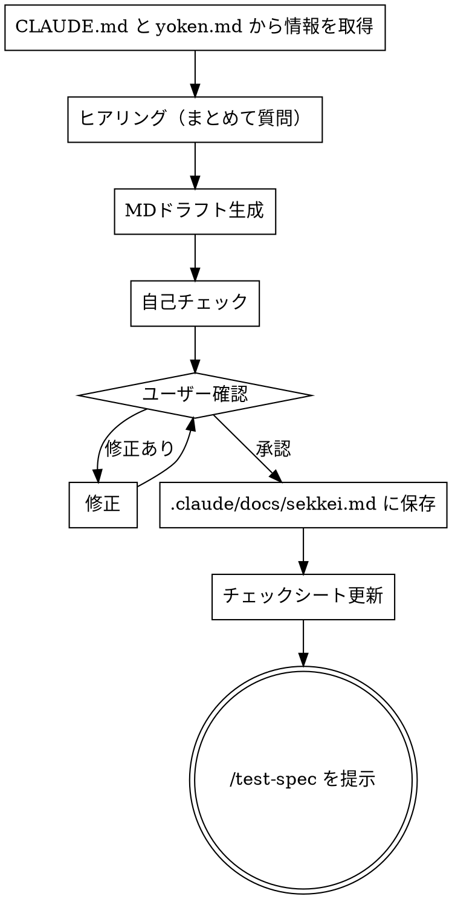

# 設計書作成

## Overview

設計書を作成する。CLAUDE.md・yoken.md から案件情報を取得し、ヒアリングで設計内容を固めてドラフトを生成、自己チェック後にユーザー確認・修正ループを経て `.claude/docs/sekkei.md` に保存する。

**なぜこの順番か:**
設計書の失敗パターンの多くは「要件定義との乖離」。yoken.md を先に読むことで要件との整合性を担保しながら設計できる。

## When to Use

- 要件定義書（yoken.md）が承認済みで、次フェーズに進むとき
- 次フェーズ（テスト仕様書作成）に進む前に設計を文書化したいとき

**対象外:**
- まだ要件定義書がないとき → `/yoken` を先に実行する
- 設計書の軽微な修正 → 直接ファイルを編集する

## The Process



### Step 1: CLAUDE.md と yoken.md から情報を取得

以下を読み取る。

- **CLAUDE.md**: 案件名・システム名・技術スタック
- **`.claude/docs/yoken.md`**: 機能一覧・非機能要件・スコープ

記載がない場合はヒアリングで補う。

### Step 2: ヒアリング

以下の項目をまとめて一度に質問する。Step 1 で取得済みの情報はスキップしてよい。

1. **システム構成** — アーキテクチャ概要・構成要素・AWS サービス構成
2. **処理フロー** — フロー図の対象・表形式で表現する処理の一覧
3. **Lambda設計** — Lambda 一覧・各 Lambda のインプット/アウトプット・処理内容
4. **IF設計** — API 一覧・画面サンプルの有無・メール通知の有無
5. **データ設計** — テーブル一覧・主要カラム・ER 図の要否
6. **ログ設計** — ログ種別・目的・出力先・ログレベル・保存期間
7. **ジョブ管理設計** — JP1/AJS3 のジョブ一覧（対象外の場合は明示）

### Step 3: MDドラフト生成

- 入力: `~/.claude/docs/templates/sekkei.md`（テンプレート）
- 出力: `.claude/docs/sekkei.md`

テンプレートに沿ってドラフトを作成する。yoken.md の非機能要件が設計に落とし込まれているか確認しながら作成する。

**設計書の構成:**

| # | セクション | 内容 |
|---|-----------|------|
| 1 | システム構成 | アーキテクチャ図・構成要素説明 |
| 2 | 処理フロー | フロー図（Mermaid 等）+ 処理概要表 |
| 3 | Lambda設計 | Lambda名・概要・インプット/アウトプット・処理内容（Lambda ごと） |
| 4 | IF設計 | API一覧・画面サンプル・メールサンプル |
| 5 | データ設計 | テーブル一覧・カラム定義・ER図 |
| 6 | ログ設計 | 種別・目的・出力先・ログレベル・保存期間 |
| 7 | ジョブ管理設計 | ネットID・ネット名・ジョブID・ジョブ名・実行サイクル・実行時間・処理内容・ジョブグループ・実行サーバー・パラメーター・備考 |

### Step 4: 自己チェック

ユーザーに見せる前に以下を確認する。問題があれば修正してから次へ。

**基本チェック:**
- [ ] yoken.md の機能一覧がすべて設計書に対応しているか
- [ ] yoken.md の非機能要件が設計に落とし込まれているか
- [ ] 設計書に対象外のスコープが明記されているか

**チェックシートを実際に読んで設計書と照合する。記憶から答えてはならない。**

以下のコマンドを実行してチェック項目を取得し、設計書の内容と1件ずつ照合する:

```bash
python3 ~/.claude/scripts/read_checklist.py 設計 --file ~/.claude/docs/templates/checklist.xlsx
```

照合ルール:
- **■ OK**: 設計書に記載あり
- **NG**: 記載が不足 → 設計書を修正してから次へ

### Step 5: ユーザー確認・修正ループ

ドラフトを提示して確認を求める。修正指示があれば修正して再提示。「承認」が得られたら次へ。

### Step 6: .claude/docs/sekkei.md に保存

`.claude/docs/sekkei.md` に固定で保存する。

### Step 7: チェックシート更新

1. `doc/{pj名-案件名}-プロセスゲート.xlsx` を開く（なければ `~/.claude/docs/templates/checklist.xlsx` からコピー）
2. チェックシートシートの設計フェーズ行を以下のルールで更新する

| 列 | 内容 | 値 |
|----|------|----|
| G列 | チェック | `■` |
| H列 | 入力日 | 今日の日付（YYYY/MM/DD） |
| I列 | 氏名 | `松山`（固定） |
| J列 | コメント | 任意 |

### Step 8: /test-spec を提示

「設計書が完成しました。次は `/test-spec` でテスト仕様書を作成できます。」と伝える。

## Checklist

- [ ] CLAUDE.md・yoken.md から案件情報を取得済み
- [ ] ヒアリング（7項目）が完了している
- [ ] 自己チェック（yoken.md整合・スコープ明記・チェックシート照合）をパス済み
- [ ] `.claude/docs/sekkei.md` に保存済み
- [ ] `doc/{pj名-案件名}-プロセスゲート.xlsx` の設計フェーズ全行を更新済み（G列: ■）
