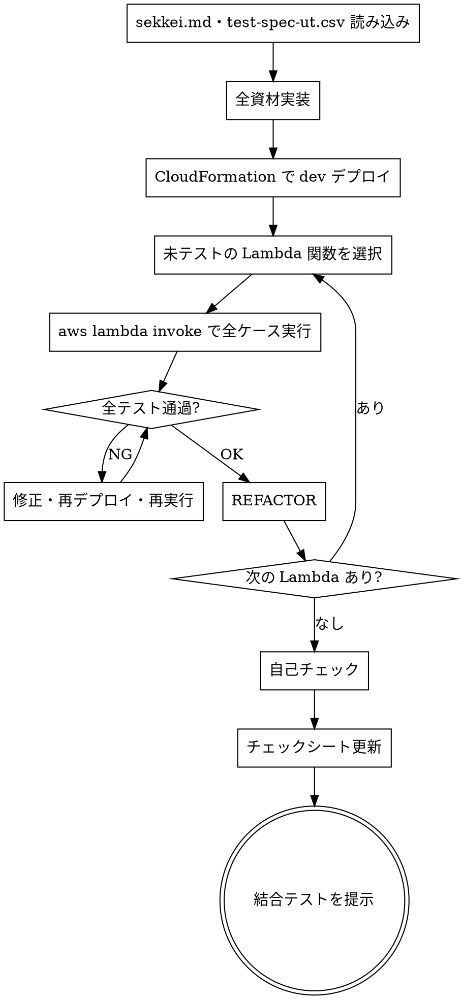

# TDD 製造

## Overview

sekkei.md をもとに全資材を実装し、CloudFormation で dev 環境に一括デプロイ後、Lambda を1関数ずつ単体テスト・修正・リファクタリングする。テスト実行には test-spec で生成した `src/tests/events/` の JSON ファイルを使用する。

## When to Use

- `/test-spec` が完了し、CSV と JSON イベントファイルが生成済みのとき

**対象外:**
- テスト仕様書がないとき → `/test-spec` を先に実行する
- 結合テスト → 別途 結合テストスキルで対応

## The Process



### Step 1: 読み込み

- `.claude/docs/sekkei.md` の Lambda 設計・IF 設計・データ設計・資材一覧を確認する
- `.claude/docs/test-spec-ut.csv` で Lambda ごとのテストケースを確認する
- `src/tests/events/` の JSON ファイルが揃っているか確認する

### Step 2: 全資材実装

sekkei.md をもとに全資材を実装する。

- Lambda 関数（Python）
- CloudFormation テンプレート（Lambda・Step Functions・API Gateway・Parameter Store・DynamoDB / SQS / S3 等）

実装順は sekkei.md の処理フロー順を推奨（上流から下流へ）。

### Step 3: CloudFormation で dev デプロイ

sekkei.md の資材一覧に記載された全リソースを一括デプロイする。

```bash
aws cloudformation deploy \
  --template-file template.yaml \
  --stack-name {スタック名}-dev \
  --capabilities CAPABILITY_IAM
```

### Step 4: Lambda 単体テスト・修正・リファクタリング（1関数ずつ）

#### テスト実行

`src/tests/events/` の JSON ファイルを使って対象 Lambda の全テストケースを実行する。

```bash
aws lambda invoke \
  --function-name {関数名} \
  --payload file://src/tests/events/UT-001.json \
  src/tests/events/UT-001-response.json
```

レスポンスを test-spec-ut.csv の「期待アウトプット」と照合する。

- **OK**: 一致
- **NG**: 不一致 → Lambda を修正して再デプロイ・再実行

#### REFACTOR

全ケース OK 後、重複・命名・構造を整理する。再デプロイして全テスト通過を確認する。

### Step 5: 自己チェック

**基本チェック:**
- [ ] test-spec-ut.csv の全テストケースが OK か
- [ ] 全 Lambda のテストが通っているか

**チェックシートを実際に読んで照合する。記憶から答えてはならない。**

```bash
python3 ~/.claude/scripts/read_checklist.py 開発・UT --file ~/.claude/docs/templates/checklist.xlsx
```

照合ルール:
- **■ OK**: 実装・テストに対応あり
- **NG**: 不足 → 修正してから次へ

### Step 6: チェックシート更新

`doc/{pj名-案件名}-プロセスゲート.xlsx` の開発・UTフェーズ行を更新する。

| 列 | 内容 | 値 |
|----|------|----|
| G列 | チェック | `■` |
| H列 | 入力日 | 今日の日付（YYYY/MM/DD） |
| I列 | 氏名 | `松山`（固定） |
| J列 | コメント | 任意 |

### Step 7: 結合テストを提示

「製造・単体テストが完了しました。次は結合テストに進んでください。」と伝える。

## Checklist

- [ ] 全資材（Lambda・CFn テンプレート等）を実装済み
- [ ] CloudFormation で dev 環境にデプロイ済み
- [ ] test-spec-ut.csv の全テストケースが OK
- [ ] 自己チェック（チェックシート照合）をパス済み
- [ ] `doc/{pj名-案件名}-プロセスゲート.xlsx` の開発・UTフェーズ行を更新済み（G列: ■）
