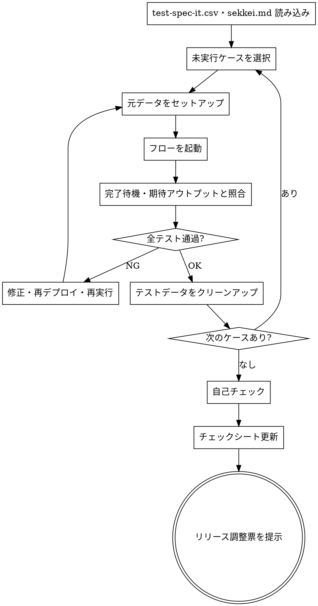

# 結合テスト

## Overview

test-spec-it.csv のシナリオを1ケースずつ実行する。元データをセットアップし、フローを起動して期待アウトプットと照合する。テストデータはテスト後にクリーンアップする。

## When to Use

- `/tdd` が完了し、全資材が dev 環境にデプロイ済みのとき

**対象外:**
- Lambda 単体テスト → `/tdd` で実施済み

## The Process



### Step 1: 読み込み

- `.claude/docs/test-spec-it.csv` でシナリオ一覧を確認する
- `.claude/docs/sekkei.md` の処理フロー・IF 設計・データ設計を確認する
- 各ケースのトリガー種別（API Gateway / S3 / EventBridge / Step Functions 直接起動 等）を sekkei.md から特定する

### Step 2: 1ケースずつ実行

#### 元データのセットアップ

test-spec-it.csv の「元データ」カラムにパスが記載されている場合はセットアップを行う。

| 元データ種別 | セットアップ例 |
|-------------|--------------|
| S3 ファイル | `aws s3 cp {元データ} s3://{バケット}/` |
| DynamoDB レコード | `aws dynamodb put-item ...` |
| なし | スキップ |

#### フローを起動

sekkei.md の処理フロー・トリガー設計をもとにフローを起動する。

| トリガー種別 | 起動例 |
|-------------|--------|
| API Gateway | `curl -X POST {エンドポイント} -d @{リクエストJSON}` |
| S3 イベント | `aws s3 cp {ファイル} s3://{バケット}/` |
| Step Functions | `aws stepfunctions start-execution --state-machine-arn {ARN} --input file://{JSON}` |
| Lambda 直接 | `aws lambda invoke --function-name {関数名} --payload file://{JSON} response.json` |

#### 完了待機・照合

非同期フロー（Step Functions 等）は完了を確認してから照合する。

```bash
aws stepfunctions describe-execution --execution-arn {ARN}
```

test-spec-it.csv の「期待アウトプット」と照合する。

- **OK**: 一致
- **NG**: 不一致 → 原因を特定し修正・再デプロイ後に再実行

#### テストデータのクリーンアップ

テストで作成したデータを削除する（次ケースへの影響を防ぐ）。

| 種別 | 例 |
|------|----|
| S3 | `aws s3 rm s3://{バケット}/{キー}` |
| DynamoDB | `aws dynamodb delete-item ...` |

### Step 3: 自己チェック

**基本チェック:**
- [ ] test-spec-it.csv の全シナリオが OK か
- [ ] 全テストデータのクリーンアップが完了しているか

**チェックシートを実際に読んで照合する。記憶から答えてはならない。**

```bash
python3 ~/.claude/scripts/read_checklist.py 結合テスト --file ~/.claude/docs/templates/checklist.xlsx
```

照合ルール:
- **■ OK**: テスト結果に対応あり
- **NG**: 不足 → 修正してから次へ

### Step 4: チェックシート更新

`doc/{pj名-案件名}-プロセスゲート.xlsx` の結合テストフェーズ行を更新する。

| 列 | 内容 | 値 |
|----|------|----|
| G列 | チェック | `■` |
| H列 | 入力日 | 今日の日付（YYYY/MM/DD） |
| I列 | 氏名 | `松山`（固定） |
| J列 | コメント | 任意 |

### Step 5: リリース調整票を提示

「結合テストが完了しました。次は `/release-chosehyo` でリリース調整票を作成してください。」と伝える。

## Checklist

- [ ] test-spec-it.csv の全シナリオが OK
- [ ] 全テストデータのクリーンアップ済み
- [ ] 自己チェック（チェックシート照合）をパス済み
- [ ] `doc/{pj名-案件名}-プロセスゲート.xlsx` の結合テストフェーズ行を更新済み（G列: ■）
