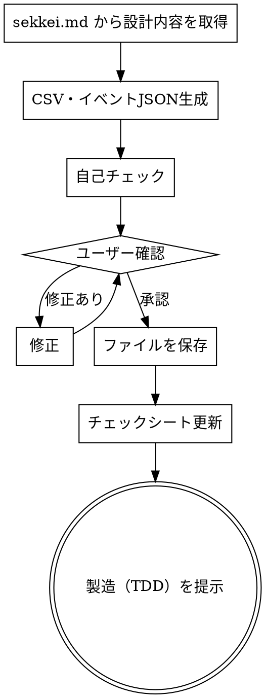

# テスト仕様書作成

## Overview

テスト仕様書を CSV 形式で作成する。sekkei.md から設計内容を読み取り、単体テスト・結合テストのテストケースを生成、自己チェック後にユーザー確認・修正ループを経て保存する。Lambda 単体テスト用のイベント JSON も同時に生成する。

**なぜ CSV か:**
テストケースは表形式で管理するのが最も見通しがよく、テストフレームワークとの連携もしやすい。

## When to Use

- 設計書（sekkei.md）が承認済みで、製造（TDD）に入る前
- テストケースを先に洗い出してから実装に臨みたいとき

**対象外:**
- まだ設計書がないとき → `/sekkei` を先に実行する
- テストケースの軽微な修正 → 直接ファイルを編集する

## The Process



### Step 1: sekkei.md から設計内容を取得

`.claude/docs/sekkei.md` から以下を読み取り、テストケースを自動で洗い出す。

- **Lambda 一覧・インプット/アウトプット** → 単体テストの対象・インプット・期待アウトプットに使用
- **処理フロー** → 結合テストのシナリオに使用
- **外部 IF・データ設計** → テストデータの構造に使用

### Step 2: CSV・イベントJSON生成

以下の3種類を生成する。

#### 単体テスト: `.claude/docs/test-spec-ut.csv`

```
テストID,テスト種別,対象,概要,詳細,分類,インプット,期待アウトプット
UT-001,単体,○○Lambda,正常系の基本処理確認,正常なペイロードを渡したとき期待通りのレスポンスを返すこと,正常,"{...}","{...}"
UT-002,単体,○○Lambda,必須パラメータ欠損時のエラー,必須項目が欠けているとき 400 エラーを返すこと,異常,"{...}","400 Bad Request"
UT-003,単体,○○Lambda,空文字・null の扱い,空文字/null を渡したとき適切にバリデーションエラーとなること,境界値,"{...}","ValidationError"
```

**分類の種類:** `正常` / `異常` / `境界値` / `負荷`

**負荷テストは要件定義書に負荷要件の記載がある場合のみ生成する。**

#### 結合テスト: `.claude/docs/test-spec-it.csv`

```
テストID,テスト種別,ケース,元データ,インプット,期待アウトプット
IT-001,結合,○○フロー正常系,/path/to/testdata.csv,"{...}","{...}"
IT-002,結合,○○フロー異常系（DB接続エラー）,,"{...}","エラー通知メール送信"
```

**元データ:** ファイルが必要な場合はパスを記載。不要な場合は空欄。

#### Lambda 単体テスト用イベント JSON: `src/tests/events/UT-XXX.json`

test-spec-ut.csv の「インプット」カラムの内容をそのまま JSON ファイルとして生成する。ファイル名はテストID。

```json
{"order_id": "123", "user_id": "abc"}
```

### Step 3: 自己チェック

ユーザーに見せる前に以下を確認する。問題があれば修正してから次へ。

**基本チェック:**
- [ ] sekkei.md の全 Lambda に対して単体テストケースがあるか
- [ ] sekkei.md の全処理フローに対して結合テストケースがあるか
- [ ] 正常系・異常系・境界値がそれぞれ含まれているか

**チェックシートを実際に読んで照合する。記憶から答えてはならない。**

```bash
python3 ~/.claude/scripts/read_checklist.py 開発・UT --file ~/.claude/docs/templates/checklist.xlsx
```

照合ルール:
- **■ OK**: テスト仕様書に記載あり
- **NG**: 記載が不足 → 修正してから次へ

### Step 4: ユーザー確認・修正ループ

ドラフトを提示して確認を求める。修正指示があれば修正して再提示。「承認」が得られたら次へ。

### Step 5: ファイルを保存

以下を保存する。

- `.claude/docs/test-spec-ut.csv`
- `.claude/docs/test-spec-it.csv`
- `src/tests/events/UT-XXX.json`（テストケース数分）

### Step 6: チェックシート更新

1. `doc/{pj名-案件名}-プロセスゲート.xlsx` を開く（なければ `~/.claude/docs/templates/checklist.xlsx` からコピー）
2. チェックシートシートの開発・UTフェーズ行を以下のルールで更新する

| 列 | 内容 | 値 |
|----|------|----|
| G列 | チェック | `■` |
| H列 | 入力日 | 今日の日付（YYYY/MM/DD） |
| I列 | 氏名 | `松山`（固定） |
| J列 | コメント | 任意 |

### Step 7: 製造（TDD）を提示

「テスト仕様書が完成しました。次は `/tdd` で実装に入ってください。」と伝える。

## Checklist

- [ ] sekkei.md から Lambda・処理フローを取得済み
- [ ] 自己チェック（全Lambda・全フロー網羅・チェックシート照合）をパス済み
- [ ] `.claude/docs/test-spec-ut.csv` に保存済み
- [ ] `.claude/docs/test-spec-it.csv` に保存済み
- [ ] `src/tests/events/UT-XXX.json` を生成済み（テストケース数分）
- [ ] `doc/{pj名-案件名}-プロセスゲート.xlsx` の開発・UTフェーズ全行を更新済み（G列: ■）
