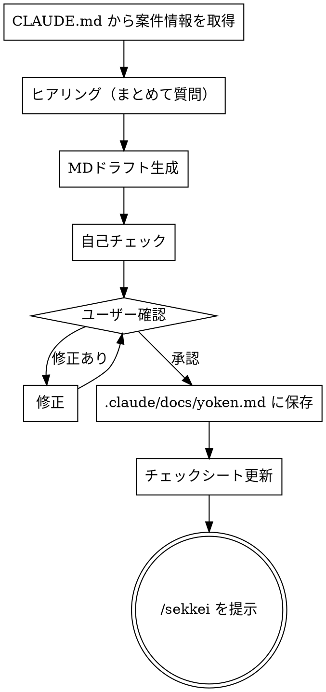

# 要件定義書作成

## Overview

要件定義書を作成する。CLAUDE.md から案件情報を取得し、ヒアリングで業務・システム要件を固めてドラフトを生成、自己チェック後にユーザー確認・修正ループを経て `.claude/docs/yoken.md` に保存する。

**なぜこの順番か:**
要件定義の失敗パターンの多くは「認識の食い違いを後から発見する」こと。ヒアリングをまとめて先にやることで、ドラフト段階でのやり直しを減らせる。自己チェックを挟むことでユーザーに見せる前の明らかな漏れを潰せる。

## When to Use

- 新機能・改修の要件定義を始めるとき
- 次フェーズ（設計書作成）に進む前に要件を文書化したいとき

**対象外:**
- すでに要件定義書があり、設計書を作りたいとき → `/sekkei` を使う
- 要件定義書の軽微な修正 → 直接ファイルを編集する

## The Process



### Step 1: CLAUDE.md から案件情報を取得

プロジェクトの CLAUDE.md から以下を読み取る。

- **案件名・システム名**
- **プロジェクト概要**（目的・背景）

記載がない場合はヒアリングで補う。

### Step 2: ヒアリング

以下の項目をまとめて一度に質問する。Step 1 で取得済みの情報はスキップしてよい。

1. **案件・機能名** — Step 1 で確認済みであれば省略
2. **業務概要** — 業務時間帯・業務量・関係するステークホルダー
3. **業務フロー** — 現行業務の流れ、対象スコープ（対象 / 対象外）
4. **システム要件・機能要件** — 機能一覧・画面・外部連携・ログ・ジョブの概要
5. **非機能要件** — 可用性・性能・監視・運用保守・移行性・セキュリティの要点
6. **制約条件** — 期限・予算・技術スタック

### Step 3: MDドラフト生成

- 入力: `.claude/docs/templates/yoken.md`（テンプレート）
- 出力: `.claude/docs/yoken.md`

テンプレートに沿ってドラフトを作成する。

### Step 4: 自己チェック

ユーザーに見せる前に以下を確認する。問題があれば修正してから次へ。

**基本チェック:**
- [ ] 業務フローにスコープ（対象 / 対象外）が明記されているか
- [ ] システム要件と業務フローに矛盾がないか

**チェックシートを実際に読んで要件定義書と照合する。記憶から答えてはならない。**

以下のコマンドを実行してチェック項目を取得し、要件定義書の内容と1件ずつ照合する:

```bash
python3 ~/.claude/scripts/read_checklist.py 要件定義 --file ~/.claude/docs/templates/checklist.xlsx
```

照合ルール:
- **■ OK**: 要件定義書に記載あり
- **NG**: 記載が不足 → 要件定義書を修正してから次へ

### Step 5: ユーザー確認・修正ループ

ドラフトを提示して確認を求める。修正指示があれば修正して再提示。「承認」が得られたら次へ。

### Step 6: .claude/docs/yoken.md に保存

`.claude/docs/yoken.md` に固定で保存する。

### Step 7: チェックシート更新

1. `~/.claude/docs/templates/checklist.xlsx` をコピーし、`.claude/docs/{pj名-案件名}-プロセスゲート.xlsx` として保存する
   - ファイルがすでに存在する場合はそのまま使用する（上書きしない）
2. チェックシートシートの要件定義フェーズ行を以下のルールで更新する

| 列 | 内容 | 値 |
|----|------|----|
| G列 | チェック | `■` |
| H列 | 入力日 | 今日の日付（YYYY/MM/DD） |
| I列 | 氏名 | `松山`（固定） |
| J列 | コメント | 任意 |

### Step 8: /sekkei を提示

「要件定義書が完成しました。次は `/sekkei` で設計書を作成できます。」と伝える。

## Checklist

- [ ] CLAUDE.md から案件名・目的・背景を取得済み
- [ ] ヒアリング（6項目）が完了している
- [ ] 自己チェック（スコープ明記・矛盾なし・チェックシート照合）をパス済み
- [ ] `.claude/docs/yoken.md` に保存済み
- [ ] `.claude/docs/{pj名-案件名}-プロセスゲート.xlsx` の要件定義フェーズ全行を更新済み（G列: ■）
