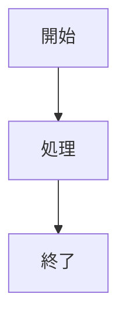

# 設計書

## 1. システム構成

### 1.1 アーキテクチャ図


### 1.2 構成要素

| サービス名 | AWSサービス種別 | 役割 |
|-----------|--------------|------|
|  |  |  |

---

## 2. 処理フロー

### 2.1 フロー図

<!-- Mermaid または DOT でフロー図を記述 -->



### 2.2 処理概要

| # | 処理名 | 概要 | 入力 | 出力 | 備考 |
|---|--------|------|------|------|------|
|  |  |  |  |  |  |

---

## 3. Lambda設計

<!-- Lambda ごとにセクションを追加する -->

### 3.1 {Lambda名}

- **概要**: 
- **トリガー**: 
- **インプット**:

```json
{
}
```

- **アウトプット**:

```json
{
}
```

- **処理内容**:
  1. 
  2. 

- **エラーハンドリング**:

---

## 4. IF設計

### 4.1 API一覧

| # | エンドポイント | メソッド | 概要 | 認証 |
|---|--------------|--------|------|------|
|  |  |  |  |  |

### 4.2 画面サンプル

<!-- 対象外の場合は「対象外」と記載 -->

### 4.3 メールサンプル

<!-- 対象外の場合は「対象外」と記載 -->

**件名**: 

**本文**:
```
```

---

## 5. データ設計

### 5.1 テーブル一覧

| テーブル名 | 論理名 | 概要 |
|-----------|--------|------|
|  |  |  |

### 5.2 テーブル定義

<!-- テーブルごとにセクションを追加する -->

#### {テーブル名}

| カラム名 | 型 | NOT NULL | PK | FK | デフォルト | 説明 |
|---------|-----|---------|----|----|-----------|------|
|  |  |  |  |  |  |  |

### 5.3 ER図

<!-- 対象外の場合は「対象外」と記載 -->

---

## 6. ログ設計

| ログ種別 | 目的 | 出力先 | ログレベル | 保存期間 |
|---------|------|--------|-----------|---------|
|  |  |  |  |  |

---

## 7. ジョブ管理設計

<!-- 対象外の場合は「対象外（バッチなし）」と記載 -->

| ネットID | ネット名 | ジョブID | ジョブ名 | 実行サイクル | 実行時間 | 処理内容 | ジョブグループ | 実行サーバー | パラメーター | 備考 |
|---------|---------|---------|---------|------------|---------|---------|-------------|------------|------------|------|
|  |  |  |  |  |  |  |  |  |  |  |
