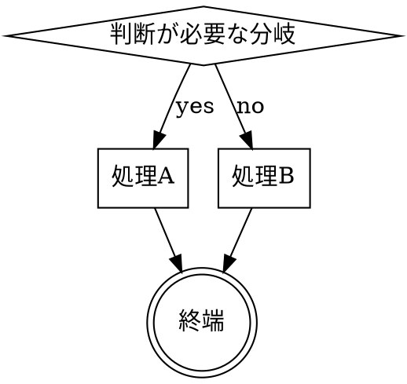

---
paths:
  - "**/commands/**/SKILL.md"
  - "**/skills/**/SKILL.md"
---

# スキル作成ルール

## 見出し構成（superpowers 準拠）

スキルの種別に応じて以下の見出し構成を使う。

### ドキュメント系 skills（書類作成・生成系）

```
## Overview       ← 目的・なぜこの設計か（WHY を必ず書く）
## When to Use    ← トリガー条件・対象外
## The Process    ← DOT グラフ + ステップ
## Checklist      ← 完了基準
```

### 製造系 skills（TDD・テスト・レビュー等の規律系）

```
## Overview                  ← 目的・Iron Law（1行で言い切る）
## When to Use
## The Process               ← DOT グラフ
## Common Rationalizations   ← 「やらない言い訳」を先に潰す
## Checklist
```

### デイリー系 skills（ohayo / tf / bye 等）

```
## Overview    ← 目的・なぜこの設計か・他スキルとの関係
## Step N      ← 手順（番号付き）
```

---

## frontmatter 規約

```yaml
---
name: skill-name-with-hyphens   # 英数字とハイフンのみ（括弧・特殊文字禁止）
description: Use when ...       # 必ず "Use when" で始める
---
```

**description に書いてはいけないもの:**
- スキルのフロー・手順の説明
- 「〜をします」「〜を実行します」などの動作説明

**description に書くもの:**
- このスキルを呼ぶべき状況・症状・トリガー条件のみ

悪い例: `description: Use when creating a document - asks questions, generates draft, saves file`
良い例: `description: Use when you need to create a requirements definition document for a new project`

---

## フローチャートの使い方

非自明な分岐・ループがある場合のみ DOT グラフを使う。



直線的な手順にはフローチャートを使わない（番号付きリストで十分）。

---

## Overview の書き方

必ず **なぜこの設計か（WHY）** を含める。

悪い例:
```
要件定義書を作成するスキル。ヒアリングしてMDを生成する。
```

良い例:
```
要件定義書はプロジェクト全体の起点になる。後工程の品質はここで決まるため、
抜け漏れなく情報を収集してから書く設計にしている。
```

